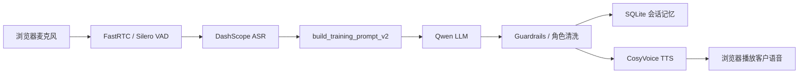

# Enterprise Sales Process Training Program

基于 FastRTC、Gradio、FastAPI 和阿里云 DashScope 的国际物流销售语音陪练原型。系统模拟不同阶段、不同难度下的企业客户，让销售员工通过实时语音完成陌 call、回访、深入回访和逼单训练。

## 当前能力

- 实时语音陪练：浏览器麦克风输入，FastRTC + Silero VAD 检测停顿，自动触发客户回复。
- ASR / LLM / TTS：DashScope 语音识别、千问文本生成、CosyVoice 语音合成。
- 训练配置：阶段、难度、客户画像、音色、头像均由 YAML 配置驱动。
- P0 案例增强：优先从 `docs/roleplay_cases.jsonl` 读取真实对练案例，生成 few-shot prompt。
- 角色防反转：对模型输出做客户身份清洗，避免客户说成销售。
- 会话记忆：SQLite 保存每轮对话，并把最近上下文注入下一轮。
- 双入口：桌面 WebRTC 控制台和移动 H5 录音上传版。

## 环境要求

- Python 3.10，当前开发环境为 `fastrtc_env`。
- Windows / PowerShell 下已验证。
- 本机需要可用的 `ffmpeg`，项目代码默认会尝试使用：

```text
D:\tools\ffmpeg\ffmpeg-master-latest-win64-gpl-shared\bin
```

也可以通过环境变量覆盖：

```powershell
$env:FFMPEG_BIN="D:\your\ffmpeg\bin"
```

## 快速开始

```powershell
cd D:\workspace\personal_project
conda activate fastrtc_env
pip install -r requirements.txt
copy .env.example .env
notepad .env
```

在 `.env` 中至少填写：

```text
DASHSCOPE_API_KEY=your_dashscope_api_key_here
```

## 启动桌面 WebRTC 控制台

推荐入口是 `core.app_new_web`：

```powershell
conda activate fastrtc_env
$env:APP_PORT="8520"
python -m core.app_new_web
```

访问：

```text
http://127.0.0.1:8520
```

页面内会嵌入 FastRTC/Gradio 语音组件：

```text
http://127.0.0.1:8520/stream
```

调试状态接口：

```text
http://127.0.0.1:8520/debug/status
```

## 启动移动 H5 录音版

移动 H5 不走 WebRTC 流，而是浏览器录音后上传到后端，适合企业微信/H5 原型验证。

```powershell
conda activate fastrtc_env
$env:APP_PORT="8511"
python -m core.app_new_wechat
```

访问：

```text
http://127.0.0.1:8511/mobile
```

接口：

```text
GET  /api/training/config
POST /api/training/voice-turn
GET  /debug/status
GET  /debug/session-turns?session_id=...
```

## 核心流程



## 目录结构

```text
core/
  app_new_web.py          桌面 WebRTC 控制台入口，挂载 fastrtc_new_web.stream
  app_new_wechat.py       移动 H5 录音上传入口
  fastrtc_new_web.py      WebRTC 实时语音增强链路，含 guardrails 和会话记忆
  fastrtc_new.py          HTTP/H5 复用链路，处理上传音频、LLM、TTS
  fastrtc_test.py         简化版 FastRTC 音频链路，用于对照和调试
  training_config.py      训练配置加载、选择器生成、prompt 构建入口
  case_loader.py          从 docs/roleplay_cases.jsonl 加载和匹配案例
  prompt_assembler.py     将案例组装成结构化 system prompt
  conversation_store.py   SQLite 会话、轮次和记忆存储
  prompts/
    customer_profile.md   基础客户扮演系统提示词
  training/
    stages/               训练阶段配置
    difficulties/         难度与卡点配置
    customers/            客户画像配置
    voices/               客户音色配置
    avatars/              客户头像/人物形象配置
docs/
  roleplay_cases.jsonl    P0 few-shot 案例数据
  raw_calls.jsonl         原始通话数据
  evaluation_rubrics.jsonl 评分维度数据
data/
  training_memory.sqlite3 本地会话记忆数据库，运行时生成
```

## 主要脚本关系

| 脚本 | 作用 |
| --- | --- |
| `core/app_new_web.py` | 桌面端页面和路由层，本身不做 ASR/LLM/TTS。 |
| `core/fastrtc_new_web.py` | 当前桌面语音主链路：WebRTC 音频、ASR、prompt、LLM、guardrails、TTS。 |
| `core/app_new_wechat.py` | 手机 H5 页面和接口层，接收录音文件并返回文字与音频。 |
| `core/fastrtc_new.py` | H5/API 业务链路，可被其他 HTTP 服务复用。 |
| `core/training_config.py` | 统一读取 YAML 配置，并提供 `build_training_prompt_v2()`。 |
| `core/case_loader.py` | 按阶段和难度匹配 JSONL 案例。 |
| `core/prompt_assembler.py` | 把案例、状态机、few-shot 和历史对话拼成 system prompt。 |
| `core/conversation_store.py` | 保存会话、轮次、最近记忆和音频长度。 |

## 配置说明

`.env.example` 提供了推荐配置项：

```text
DASHSCOPE_API_KEY=
DASHSCOPE_ASR_MODEL=paraformer-realtime-v2
DASHSCOPE_LLM_MODEL=qwen-turbo
DASHSCOPE_TTS_MODEL=cosyvoice-v1
DASHSCOPE_TTS_VOICE=longxiaochun

APP_PORT=8520
CUSTOMER_PROFILE_PATH=

TRAINING_STAGE_ID=cold_call
TRAINING_CUSTOMER_ID=auto
TRAINING_DIFFICULTY_ID=easy
TRAINING_VOICE_ID=longsanshu_v3
TRAINING_AVATAR_ID=wang_ms_avatar
TRAINING_DB_PATH=
```

训练阶段目前包括：

- `cold_call`：陌 call
- `follow_up`：回访
- `deep_follow_up`：深入回访
- `closing`：逼单

难度目前包括：

- `easy`
- `normal`
- `hard`
- `expert`

## 调试建议

- 如果没有客户回复，先看 `/debug/status` 中的 `stage`、`prompt`、`response_text`、`error`。
- 如果延迟很大，重点看 ASR 阶段是否把过长音频片段送去识别；常见原因是 VAD 没有及时判停、扬声器回声被麦克风再次收进去、环境噪音持续触发。
- 如果 H5 无法录音，确认浏览器是否允许麦克风权限；手机端通常需要 HTTPS 或内网可信环境。
- 如果 TTS 没声音，确认 DashScope Key、音色配置和浏览器自动播放策略。

## 已知注意事项

- 当前推荐直接运行 `python -m core.app_new_web` 或 `python -m core.app_new_wechat`。
- 根目录 `run_app.py` 仍是旧入口形式，后续可以统一改为正式启动器。
- `core/app_demo.py` 依赖旧的 `fastrtc_test_old` 和 `index.html`，当前不作为推荐入口。
- `docs/roleplay_cases.jsonl` 当前案例数量较少，继续扩充后 P0 few-shot 效果会更稳定。
